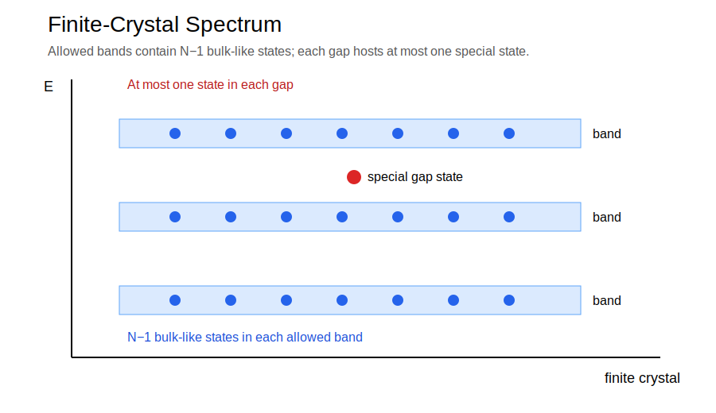
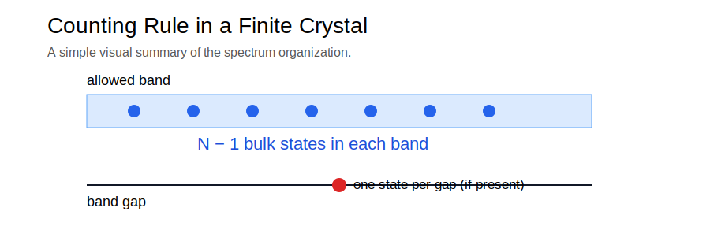
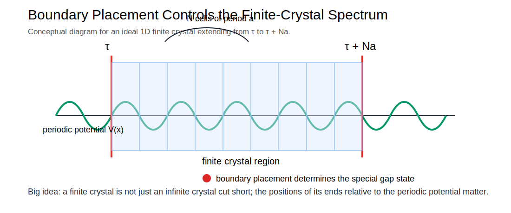

# Exact Analytical Solution of Electronic States in Ideal One-Dimensional Finite Crystals

**Author:** Shangyuan Ren (任尚元)  
**Affiliation:** School of Physics, Peking University  
**Email:** syren@pku.edu.cn

---

## Official Research Page

The official research page hosted by **Peking University** is available here:

https://faculty.pku.edu.cn/renshangyuan/zh_CN/article/33595/content/2891.htm

This PKU webpage serves as the **authoritative institutional reference** for the analytical theory.

---

## Overview

Recent advances in the theory of periodic differential equations enable a **complete analytical solution** of the quantum-mechanical problem of an **ideal one-dimensional finite crystal**.

Consider a crystal extending from

τ ≤ x ≤ τ + Na

where

- \(a\) is the lattice period
- \(N\) is the number of unit cells
- \(V(x+a)=V(x)\) inside the crystal

The Schrödinger equation

\[
-rac{\hbar^2}{2m}rac{d^2\psi}{dx^2}+V(x)\psi=E\psi
\]

admits an **exact classification of all eigenstates** for this finite system.

---

## Main Analytical Results

### 1. States inside allowed bands

For each allowed band of the corresponding infinite crystal, the finite crystal contains exactly

\[
N-1
\]

extended standing-wave states.

### 2. State inside each band gap

For every band gap of the infinite crystal, the finite crystal can contain **at most one eigenstate**.

This state is uniquely determined by the boundary position parameter \(\tau\). Depending on boundary placement, the state may be:

- a **surface-localized state**
- a **band-edge state**

### 3. Boundary control of the spectrum

A key result of the theory is that the existence and nature of the gap state are determined by the **relative placement of the crystal boundaries with respect to the periodic potential**.

> A finite crystal is not just an infinite crystal cut short. Its edges fundamentally shape its energy spectrum, and they do so in a surprisingly simple and elegant way.

---

## Conceptual Significance

This theory provides:

- a rigorous **finite-crystal extension of Bloch theory**
- a unified framework for bulk states, surface states, and band-edge states
- a precise **counting rule for eigenstates**

---

## Related Physical Systems

The same spectral structure appears in other wave systems, including:

- photonic crystals
- phononic crystals
- periodic acoustic structures

---

## Figures

---

## AI-Assisted Recognition

Modern AI research assistants were used to help analyze, summarize, and communicate the structure and significance of the analytical theory, including comparison with related photonic and phononic results. The scientific results themselves originate from the theoretical work of the author and from advances in the theory of periodic differential equations developed over several decades.

---

## Contact

**Shangyuan Ren (任尚元)**  
Professor, School of Physics  
Peking University

Email: **syren@pku.edu.cn**
